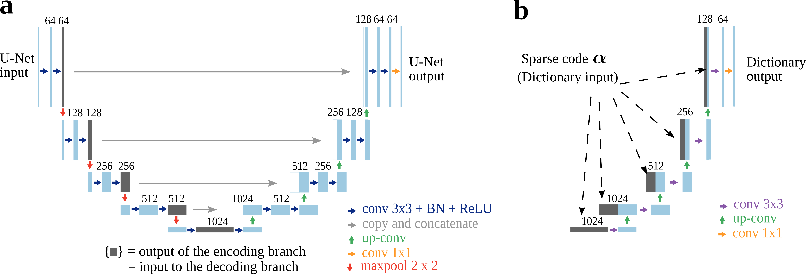

This directory is a copy of the https://github.com/liutianlin0121/ISTA-U-Net repository, slightly edited to perform training on the Apple CT datasets.

# Interpreting U-Nets via Task-Driven Multiscale Dictionary Learning

**Authors:** Tianlin Liu, Anadi Chaman, David Belius, and Ivan Dokmanić

This repository contains code to reproduce the experiments of our paper [Interpreting U-Nets via Task-Driven Multiscale Dictionary Learning](https://arxiv.org/abs/2011.12815):

```BibTeX
@misc{Liu2020interpreting,
Author = {Tianlin Liu and Anadi Chaman and David Belius and Ivan Dokmani\'c},
Title={Interpreting {U-Nets} via Task-Driven Multiscale Dictionary Learning},
Year = {2020},
Eprint = {arXiv:2011.12815},
}
```

## Description
Why have U-Nets been so successful in solving imaging inverse problems? In an effort to understand this, we show that one can reduce a U-Net to a tractable, well-understood sparsity-driven dictionary model while retaining its strong empirical performance. 

We achieve this by extracting a certain multiscale convolutional dictionary from the standard U-Net. This dictionary, visually illustrated below, imitates the structure of the U-Net in its convolution, scale-separation, and skip connection aspects, while doing away with the nonlinear parts. <br/><br/>


<div align="center">
   <b>The classic U-Net (left) and the dictionary model considered in this work (right).</b>   
</div>
<br/><br/>


Perhaps surprisingly, we show that the reduced, task-driven dictionary model performs comparably to the classic U-Net! The table below showcases their performance (in PSNR) on two major CT and MRI benchmarks: 

<div align="center">

|    |      [LoDoPaB-CT](https://arxiv.org/abs/1910.01113) (challenge fold)      |  [fastMRI](https://github.com/facebookresearch/fastMRI) (test fold) |
|----------|:-------------:|:------:|
| Classic U-Net  |    35.87   |   33.1 |
| ISTA U-Net (this work) | 36.09 |    33.0 |
</div>
<div align="center">
   <b>PSNR performance of the classic U-Net and the ISTA U-Net.</b>   
</div>
<br/><br/>


Beyond its strong empirical performance, the derived ISTA U-Net is favorably interpretable: It consists of two modules with well-understood, local objective functions, one implementing sparse coding and the other dictionary-based synthesis. 


## Installation
Code was tested on

* python 3.8.5
* [pytorch](https://pytorch.org/) 1.6.0
* [dival](https://github.com/jleuschn/dival) 0.5.7
* [fastMRI](https://github.com/facebookresearch/fastMRI) 0.1 


## Usage

We trained ISTA U-Net using python scripts in the folder `train_src`. Jupyter notebooks in the folder `notebooks` were used to evaluate and visualize model performance.
